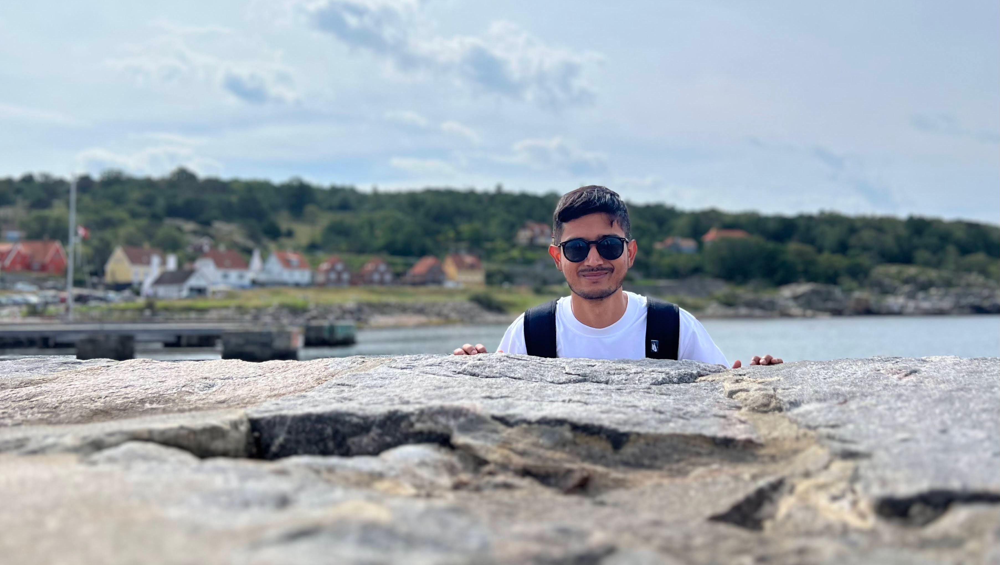

# 🌟 Akash Kumar Yadav: A Data Scientist's Journey

## 🛣️ From Bangalore to Trier: A Tale of Curiosity and Innovation

Namaste! I'm Akash Kumar Yadav, a data scientist with a passion for solving puzzles and building innovative solutions. My journey began in Bangalore, the Silicon Valley of India, where my childhood curiosity for problem-solving laid the foundation for my future in data-driven decision-making.

## 🧠 The Analytical Mind

As a kid, I had a knack for solving puzzles and building things. This natural inclination seamlessly extended into my professional life, where I now contribute to data-driven decision-making across various industries. With over 5 years of experience in data science and advanced analytics, I've honed my skills in machine learning, statistical analysis, and turning complex data into actionable insights

## 🌍 A Global Perspective

My thirst for knowledge and new experiences led me from the bustling streets of Bangalore to the charming city of Trier, Germany. Here, I'm pursuing my M.Sc. in Data Science, expanding my horizons both academically and culturally. This journey has allowed me to explore over 20 countries, each adding a unique perspective to my worldview and approach to problem-solving

## 💼 Professional Adventures

My career has been a thrilling ride across diverse industries and roles:

### 🏭 BASF: Enhancing Analytical Capabilities

At BASF, I've been instrumental in setting up the Data Lab, leveraging advanced technologies to boost consultants' analytical capabilities. From automating log extraction to implementing LLMs for sentiment analysis, I've been at the forefront of innovation

### 🛒 Amazon: Streamlining Business Intelligence

During my internship at Amazon, I developed dashboards that automated pricing comparisons, saving 200 hours half-yearly. My work in creating ETL pipelines and business reports significantly reduced team workload

### 💼 EY and Landmark Group: Data-Driven Solutions

At EY and Landmark Group, I tackled supply chain operations and customer value management, developing propensity models and improving campaign targeting

## 🎓 Continuous Learning

My journey in data science is ongoing. Currently pursuing my M.Sc. in Data Science at Universität Trier, I'm diving deep into advanced statistical analysis, machine learning techniques, and big data analytics

## 🌠 Beyond the Data

When I'm not immersed in data, you'll find me:

-   📸 Capturing the beauty of the night sky through low-light photography
-   🏎️ Following the high-octane world of Formula 1
-   🎹 Learning to play the piano
-   📚 Expanding my knowledge through reading
-   🗣️ Improving my German language skills

## 🚀 Looking Ahead

As I continue to challenge myself and innovate in the world of data science, I'm excited about the possibilities that lie ahead. Whether it's developing cutting-edge machine learning models or finding new ways to visualize complex data, I'm always ready for the next big challenge.Let's connect and explore how we can leverage data to drive innovation and make informed decisions!
